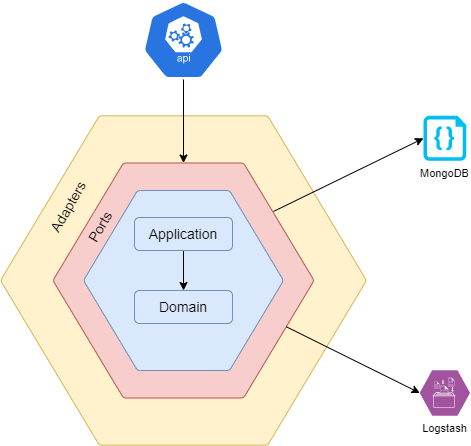



# What is Aurora project?
It's an open source project, written in .NET, currently in version 6.

The project's goal is to show how can we use the Hexagonal Architecture concepts and using some concepts like DDD to create an API.

## Business proposal:
This project is a simple PPE Management. The principle idea is to register workers and PPE and, with this data, allow to transfer PPE to a worker.
Besides that, this system allows that you see all the PPE and who has a PPE and notify if the PPE is near to expire.

### Abbreviations:
* NIN: National Insurance Number (as CPF in Brazil)
* PPE: Personal Protective Equipment
* DDD: Domain Driven Design

## How to use:
1. Clone this project to into your machine
2. Run MongoDB container (like on Docker)
    2.1. Inform the right connection string in project
3. Finally, build and run the application

## Technologies:
* .NET 6
* C# 10
* MongoDB
* FluentValidation
* Swagger
* .NET Core Native DI

## Architecture:
* Hexagonal Architecture
* Domain Validations
* Domain Notifications
* Repository Pattern
* Notification Pattern
* Value Types
* Monolith

## Principles:
* Domain Driven Design
* Clean Code
* S.O.L.I.D.

---

## Hexagonal Architecture

### Why did I choose this design?
* It's very easy to include, or exclude, a framework or external library in a separate DLL.
* The focus is in Core layer. So the business rules/your domain stay very uncoupled of external things.
* I'm an enthusiast for this Design 😁🤓

---

## Why Aurora?
The name Aurora came from the natural event called Aurora Borealis. It is a scientific event described by the interaction between the earth's magnetic layer and energized particles from the solar wind.

A curiosity about such an event is that what we see in photographs is not always the same image that is seen live.

For more information, look this [link](https://www.hipercultura.com/fenomenos-naturais/).

## About:
The Aurora project was developed by [Alex Alves](https://www.linkedin.com/in/alexalvess/).

---

# References:
* [Start in .NET Core with Layer Architecture, Alex Alves](https://medium.com/@alexalves_85598/criando-uma-api-em-net-core-baseado-na-arquitetura-ddd-2c6a409c686)
* [Organize your Project with Hexagon Architecture - Part 01, Alex Alves](https://alexalvess.medium.com/organizando-seu-projeto-net-com-arquitetura-hexagonal-parte-01-a598662a3818)
* [Organize your Project with Hexagon Architecture - Part 02, Alex Alves](https://alexalvess.medium.com/organizando-seu-projeto-net-com-arquitetura-hexagonal-parte-02-fe9a8ed6ab02)
* [Eventual Shop, a State of the art Distributed System, Antônio Falcão](https://github.com/AntonioFalcaoJr/EDA.CleanArch.DDD.CQRS.EventSourcing)